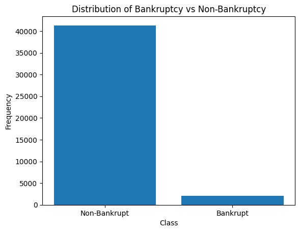

## Polish Company Bankruptcy Prediction
### Abstract
This project employs machine learning techniques to predict whether a company will bankrupt or not based on a set of financial indicators. By analyzing the Polish Companies Bankruptcy dataset from the UCI Machine Learning Repository, our goal is to develop a model that can accruate predict the bankruptcy of a company in making informed decisions.

### Introduction

**Background:**  For nearly a century, economists have been engaged in developing methods to predict corporate bankruptcies, underscoring its critical importance for stakeholders. This research aids investors, creditors, and regulatory bodies in making informed decisions and managing risk effectively.

**Objective:** The primary goal of this project is to develop a robust predictive model that leverages various economic indicators to assess and forecast the financial health of companies. This model aims to enable early identification of potential bankruptcy, helping to mitigate financial losses and improve financial stability.

**Historical Approaches:**  Initially, the field focused on linear statistical techniques and basic hypothesis testing to identify financial distress. Over the decades, as computational power and data availability have increased, the focus has shifted towards more sophisticated methods. The integration of machine learning and artificial intelligence into this research represents the latest evolution, promising higher accuracy and better adaptability to complex financial environments..

**Project Focus:** This project seeks to apply cutting-edge machine learning algorithms learned in academic coursework to real-world data. By doing so, it aims to not only validate the effectiveness of these methods but also explore their potential to outperform traditional models in predicting company bankruptcies. The project will use historical data from Polish companies, combining traditional financial ratios with newer, non-linear modeling techniques to provide a comprehensive assessment of bankruptcy risk.

### Source

**Dataset:** Polish Companies Bankruptcy
- **Source:** UCI Machine Learning Repository
- **Description:** This dataset focuses on the prediction of bankruptcy for Polish companies.
- **Time Frame:** Bankrupt companies from 2000 to 2012, operating companies from 2007 to 2013.
- **Purpose:** To develop models that can accurately predict the financial health and potential bankruptcy of companies based on historical data.

### Data Setup

1. Drop Missing Values
2. Split into Test and Train sets
3. Target Variable: Bankruptcy (Binomial)
4. Feature Variables: A1-A64 (Numerical)

### Methodology

#### Logistic Regression
- **Technique:** Subset Selection Cross-validation

- **Performance Metrics:**
  -  
1. **Accuracy (95.74%)**
   - This metric tells us that the model correctly predicts the outcome (whether a company will go bankrupt or not) 95.74% of the time. This might seem like an excellent result at first glance. 

2. **Precision (9.09%)**
   - Precision measures the accuracy of positive predictions. Here, it tells us that only about 9.09% of the cases that the model predicted as bankruptcy actually ended up being bankrupt. This is quite low, indicating that while the model frequently predicts bankruptcy, those predictions are often incorrect. 

3. **Recall (2.94%)**
   - Recall, or sensitivity, measures the ability of a model to find all the relevant cases (true positives). A recall of 2.94% is extremely low, indicating that the model fails to identify the vast majority of actual bankruptcies. 

4. **F1 Score (4.44%)**
   - The F1 Score is the harmonic mean of precision and recall. An F1 Score of 4.44% is very low, which in this context suggests a model that is both imprecise and not very effective at identifying most of the true positives (i.e., actual bankruptcy cases). 

##### Interpretation:

- Despite the high accuracy, the very low values for precision, recall, and F1 score suggest that the model is not effective in predicting bankruptcy. This discrepancy is often seen in datasets where one class (e.g., 'not bankrupt') significantly outnumbers the other (e.g., 'bankrupt'). The model might be simply predicting the majority class most of the time, achieving high accuracy but being practically useless for identifying bankruptcy cases. 
- Given the serious imbalance reflected in these scores, it might be necessary to revisit the model's approach. Techniques like balancing the dataset, changing the model's decision threshold, or using different algorithms more suited to imbalanced data might be required to improve these critical metrics.

#### Gradient Boosting
- **Technique:** Features Selection Using Decision Trees

 

The selected features provided insight into the liquidity, profitability, efficiency, and leverage of a company. Those are often time indicator to bankruptcy of a company. 
1. A24: Gross Profit (in 3 years) / Total Assets 
This ratio measures a company's profitability relative to its total assets, showing how effectively a company uses its assets to generate gross profit. A declining trend over three years might indicate decreasing efficiency or increasing risk of financial distress. 
2. A46: (Current Assets - Inventory) / Short-Term Liabilities 
Also known as the "quick ratio," it measures a company's ability to meet its short-term obligations with its most liquid assets. This is a critical indicator of liquidity without relying on inventory, which is less liquid. 
3. A58: Total Costs / Total Sales 
This ratio evaluates how much of the sales revenue is consumed by the total costs, providing insights into the cost structure and efficiency of the company. Higher values suggest lower profitability and possibly financial troubles. 
4. A5: [(Cash + Short-Term Securities + Receivables - Short-Term Liabilities) / (Operating Expenses - Depreciation)] * 365 
This complex ratio assesses the liquidity management of a company, focusing on how long the company's liquid assets, after adjusting for immediate liabilities, can cover its day-to-day operations (excluding depreciation, a non-cash expense). 
5. A34: Operating Expenses / Total Liabilities 
This ratio indicates how much of the company's liabilities are covered by its operating expenses. A higher ratio can signal that the company is using a significant portion of its revenue to cover operational costs, which may not be sustainable. 
6. A39: Profit on Sales / Sales 
Known as the "profit margin," this ratio measures the percentage of profit generated from sales. It is a fundamental indicator of a company’s profitability. Consistently low or declining profit margins can be a precursor to financial troubles. 
7. A56: (Sales - Cost of Products Sold) / Sales 
This is the gross margin ratio, showing the proportion of money left from revenues after accounting for the cost of goods sold (COGS). It indicates the efficiency of production or service delivery and the pricing strategy. 

- **Performance Metrics:**
  - MSE, F1 Score 

### Discussion

1. **Variable Importance:** The predictors selected by the two models do not overlap, raising questions about which variables are most critical in predicting bankruptcy.
2. **Recall Rate:** Although model accuracy is high, the recall rate is low, indicating failure in identifying the majority of positive cases (bankruptcy).
3. **Correlation Between Variables:** Potential correlations may exist between variables.
4. **Multicollinearity:** All 64 features are transformations of basic indexes like gross profit, total liability, and book value. Treating them as individual predictors may lead to severe multicollinearity issues, suggesting a need for alternative methods or calculations.

### Future Improvement
 
*Figure 1: Bar graph showing the distribution of bankruptcy vs non-bankruptcy in the dataset.* 

Because of imbalance dataset, we can see that our models often time falls into type II error. One potential way to improve is implementing the resamping technique.
#### Resampling Techniques for Handling Imbalanced Datasets
###### 1. **Undersampling the Majority Class**
Undersampling involves reducing the size of the majority class to balance the dataset. This method is straightforward and can help improve the run-time of training models since it reduces the dataset size. However, it has some significant drawbacks: 
**Pros and Cons** 
-*Loss of Information:* By randomly removing instances from the majority class, potentially valuable information is discarded, which could be important for building a robust model. 
-*Bias:* If the majority class instances that are removed are not representative of the class, this can introduce bias into the model. 

###### 2. **Oversampling the Minority Class** 
Oversampling involves increasing the size of the minority class by duplicating existing instances or generating synthetic instances. This approach is beneficial because no information from the majority class is lost, but it can lead to other issues: 
**Pros and Cons** 
-*Overfitting:* By replicating the minority class instances, the model might overfit these repeated or closely similar examples, performing well on training data but poorly on unseen data. 
-*Increased Training Time:* Increasing the number of samples can lead to longer training times.

